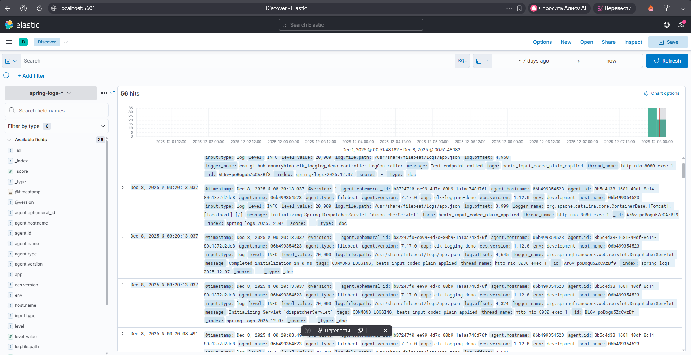

# ELK Logging Demo

Spring Boot приложение с интеграцией ELK стека для логирования.

## Структура
- `docker-compose.yml` - ELK стек (Elasticsearch, Kibana, Logstash, Filebeat)
- `filebeat-config/` - конфигурация Filebeat
- `logstash-config/` - конфигурация Logstash
- `logs/` - директория для логов (создаётся автоматически)

## Запуск
1. Запустить Spring Boot приложение
2. `docker-compose up -d`
3. Kibana: http://localhost:5601
4. Создать index pattern: `spring-logs-*`

## Проверка
- `curl http://localhost:8080/api/test`
- Логи появятся в Kibana Discover

